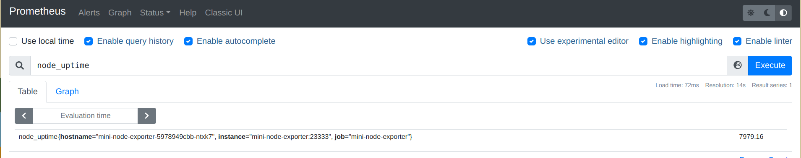
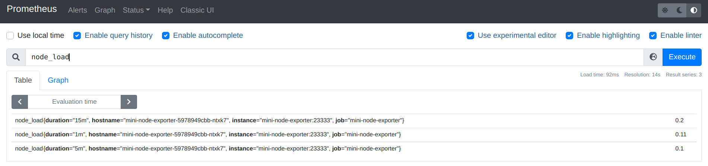
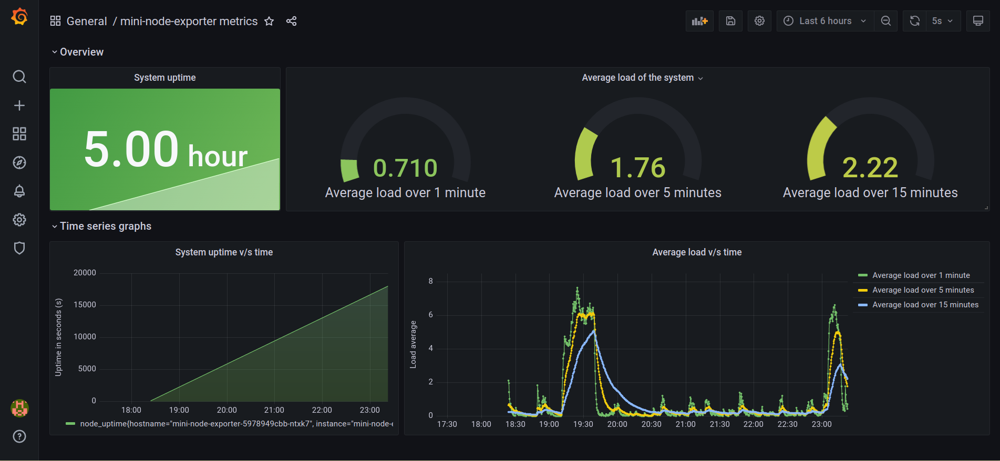

# mini-node-exporter

Hi, mini-node-exporter is a project as the interview for [mentorship program of Chaos Mesh on LFX Mentorship 2021 fall](https://mentorship.lfx.linuxfoundation.org/project/8db683b0-0273-4a83-9ed9-4c33ee2cfcf0).

## Overview

There are three goals of this small project:

1. build a web application that exposes several metrics
2. collect and make a dashboard for the exposed metrics
3. orchestrate the deployment of the web application and the monitoring tools.

## Build

### Requirements
- Golang
- Docker & Kubernetes (for orchestration)

Build the binary as follows,
```sh
$ git clone https://github.com/PrayagS/mini-node-exporter.git
$ cd mini-node-exporter
$ go build -o main ./cmd/main.go
```

## Run

Run the binary as follows,
```sh
$ ./main
```

You can also run the application using Docker as follows,
```sh
$ docker run -it --rm -p 23333:23333 prayagsavsani/mini-node-exporter:latest
```

The web application listens on `0.0.0.0:23333` and exposes the following endpoints,
- `/info/hostname`: Shows the hostname with plain text
- `/info/uptime`: Shows the uptime of the system in seconds with plain text
- `/info/load`: Show the load average in 1m, 5m and 15m with JSON, example `{"1m": 0.57, "5m":0.80, "15m":0.77}`
- `/metrics`: Expose the following metrics that could be scraped by prometheus,
  - `node_uptime`: system uptime in seconds (s)
  - `node_load`: average system load over a certain duration (1 minute, 5 minutes, and 15 minutes in this case)

In case you're running the monitoring stack locally, skip to the [Monitor](#monitor) section.

## Deploy

Deployment is done using `kustomize` which allows us to maintain the monitoring configuration in separate files. Apply the manifests as follows,
```sh
$ kubectl apply -k kustomize/
```
This will deploy the exporter as a `DaemonSet` which makes it such that the application runs on every node in the cluster. Prometheus and Grafana are deployed in pods and their configuration is stored in configmaps.

All three services deployed are of the type `NodePort`. Keep this in mind when trying to expose them to your host.

## Monitor

### Prometheus

The exposed metrics can be easily queried from the Prometheus dashboard.



### Grafana

The Grafana dashboard is named as `mini-node-exporter-dashboard`. It looks as follows,



The system uptime is shown as a `Stat` value and also as a time series graph. The system load is also shown as a time series graph alongwith color-coded gauges.

## Design

### The web application

The http server is coded using the default `net/http` package. The routing and handlers are coded using `gorilla/mux` and `gorilla/handlers`. The handlers for all the endpoints can be found in `web/handlers/handlers.go`.

### Reading the metrics

The respective handler for each metric endpoint calls the respective getter function from `pkg/procfs/procfs.go`. As the name suggests, all the metrics are read from `procfs`. The exact files being read are,
- `/proc/sys/kernel/hostname` for hostname
- `/proc/uptime` for system uptime
- `/proc/loadvg` for average load values

### Collecting and exposing to Prometheus

Initially, I had defined the metrics using the default metric types present in Prometheus viz. `GaugeVec` and updating their values. But then I took some inspiration from the way `prometheus/node_exporter` is coded. I ended up implementing the `Collector` interface of Prometheus. I could have implemented a `NodeCollector` which is the way `node_exporter` does it, but that was ending up to be very complex.

As a result, I implemented the `Describe` and `Collect` methods for two collectors, `uptimeCollector` and `loadAvgCollector`. The relevant code can be found in `pkg/collectors/`.


## References

- [Getting started | Prometheus](https://prometheus.io/docs/prometheus/latest/getting_started/)
- [proc(5)](https://man7.org/linux/man-pages/man5/proc.5.html)
- [Getting started with Grafana and Prometheus](https://grafana.com/docs/grafana/latest/getting-started/getting-started-prometheus/)
- [Best practices for creating dashboards](https://grafana.com/docs/grafana/latest/best-practices/best-practices-for-creating-dashboards/)
- [node_exporter/collector.go at master · prometheus/node_exporter](https://github.com/prometheus/node_exporter/blob/master/collector/collector.go)
- [Writing exporters | Prometheus](https://prometheus.io/docs/instrumenting/writing_exporters)
- [Standard Go Project Layout](https://github.com/golang-standards/project-layout)
